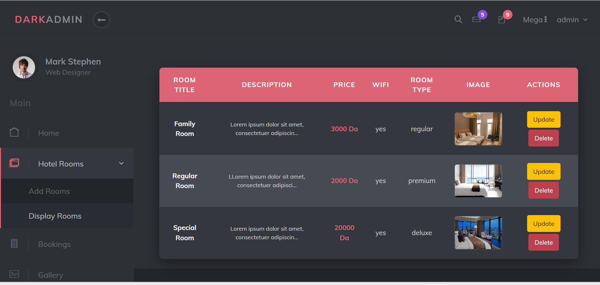
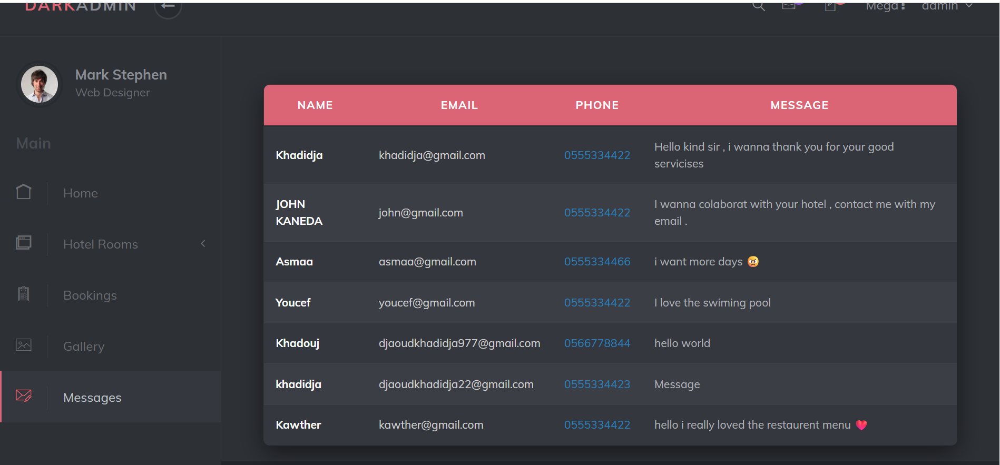
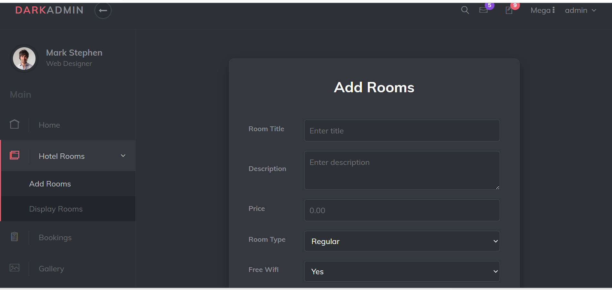
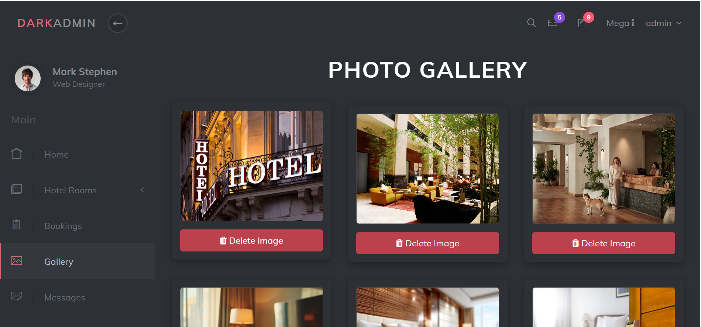
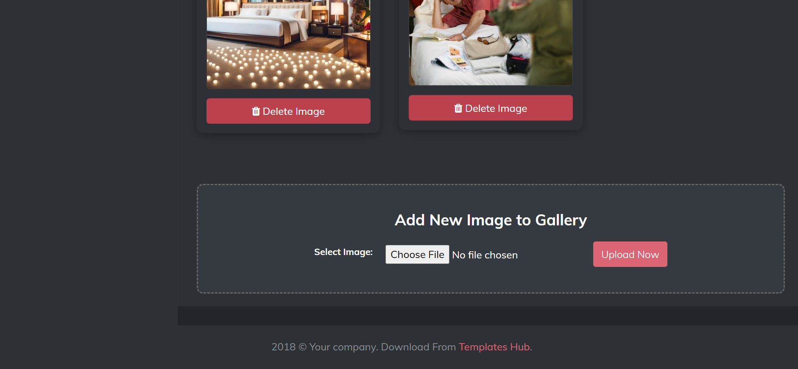
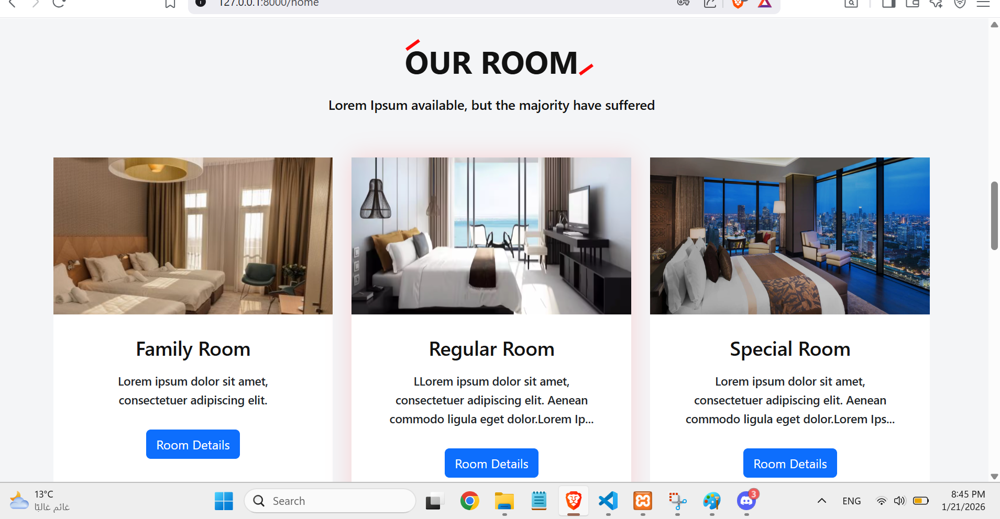
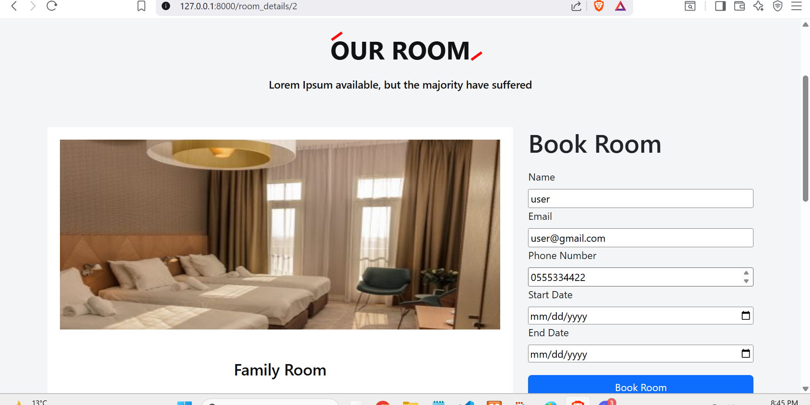
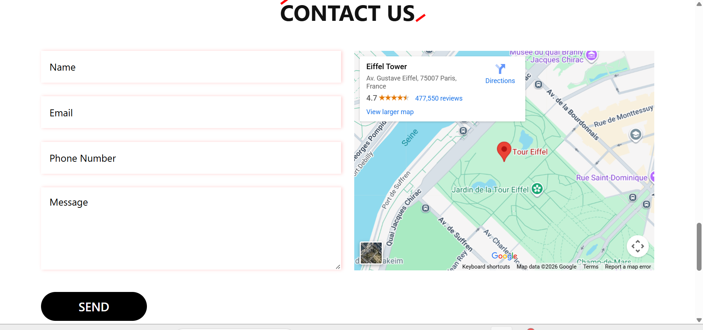

# Hotel Management System (Laravel)

A comprehensive, full-stack web application designed to manage hotel operations. This project features a high-performance Visitor Website for room bookings and a powerful Admin Dashboard for hotel management.

## Key Features

- **Visitor Website**
- Dynamic Room Gallery: Browse rooms with real-time status availability.

- Online Booking System: Securely book rooms with date selection.

- Contact & Inquiries: Integrated messaging system to contact hotel staff.

- Responsive Design: Fully optimized for mobile, tablet, and desktop views.

- **Admin Dashboard**
  - Room Management: Add, update, and delete room details and high-quality images.

- Booking Control: Approve or reject pending customer reservations.

- Email System: Send direct email notifications to customers from the dashboard.

- Gallery Management: Upload and manage hotel lifestyle photos.

- Real-time Statistics: Track total rooms, bookings, messages, and revenue.

## Tech Stack

Backend: Laravel (PHP)

Frontend: Blade Templates, Bootstrap 4/5, CSS3, JavaScript

Database: MySQL

Emailing: Laravel Notifications (Mailtrap/SMTP)

## 📸 Screenshots

### Admin Dashboard

### Visitor Website

